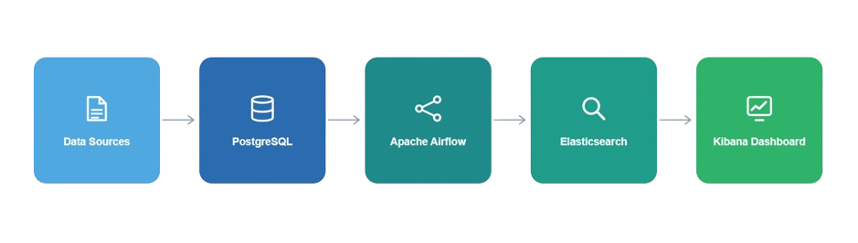

# Restaurant Data Engineering Pipeline

An end-to-end containerized data engineering pipeline for restaurant analytics using PostgreSQL, Apache Airflow, Elasticsearch, and Kibana.

---

## Project Overview

This project processes restaurant metadata and synthetic order events through a reproducible ETL and analytics workflow.

The system:

- Loads restaurant data from CSV files
- Generates realistic synthetic order events using Faker
- Validates and aggregates restaurant/order information
- Stores cleaned data in PostgreSQL
- Orchestrates workflows using Apache Airflow
- Indexes analytical summaries into Elasticsearch
- Visualizes trends and distributions using Kibana dashboards

---

## Architecture



Pipeline flow:

```text
CSV Dataset
    ↓
PostgreSQL (restaurants + orders)
    ↓
Airflow DAG
    ↓
Summary Aggregation
    ↓
Elasticsearch Index
    ↓
Kibana Dashboards
```

---

## Technologies Used

- Python
- PostgreSQL
- Apache Airflow
- Elasticsearch
- Kibana
- Docker & Docker Compose
- Faker
- Pandas
- Psycopg2

---

## Project Structure

```text
.
├── dags/
│   └── restaurant_pipeline.py
│
├── data/
│   ├── zomato.csv
│   └── Country-Code.csv
│
├── assets/
│   └── pipeline-diagram.png
│
├── postgres/
│   └── init.sql
│
├── scripts/
│   ├── load_restaurants.py
│   ├── generate_orders.py
│   └── index_summary.py
│
├── .env.example
├── .gitignore
├── docker-compose.yml
├── Dockerfile
├── requirements.txt
└── README.md
```

---

## Features

### Data Loading
- Loads restaurant metadata from CSV datasets
- Handles schema normalization and preprocessing

### Synthetic Data Generation
- Generates realistic order events using Faker
- Produces:
  - timestamps
  - order amounts
  - delivery types
  - weighted restaurant activity

### Workflow Orchestration

Apache Airflow DAG includes:

1. Restaurant validation
2. Order validation
3. City-cuisine summary generation
4. Elasticsearch indexing

### Search & Analytics

Elasticsearch indexes aggregated analytics documents for:
- fast filtering
- cuisine exploration
- city-based analysis

### Visualization

Kibana dashboards provide:
- Order Volume by City
- Restaurant Density by City
- Cuisine Order Share
- Avg Order Value by City

---

## Setup Instructions

### 1. Clone Repository

```bash
git clone <your-repo-url>
cd restaurant-pipeline
```

---

### 2. Create Environment File

Create a `.env` file from the example:

```bash
cp .env.example .env
```

---

### 3. Run the Entire System

```bash
docker compose up --build
```

This command starts:
- PostgreSQL
- pgAdmin
- Apache Airflow
- Elasticsearch
- Kibana

and automatically:
- loads restaurant data
- generates synthetic orders
- creates analytical summaries
- indexes Elasticsearch documents

---

## Service URLs

| Service | URL |
|---|---|
| Airflow | http://localhost:8090 |
| pgAdmin | http://localhost:8080 |
| Elasticsearch | http://localhost:9200 |
| Kibana | http://localhost:5601 |

---

## Default Credentials

### PostgreSQL

```text
Username: admin
Password: admin
```

### pgAdmin

```text
Email: admin@example.com
Password: admin
```

### Airflow

```text
Username: admin
Password: admin
```

---

## Airflow DAG

DAG name:

```text
restaurant_pipeline
```

Tasks:
- `check_restaurants`
- `check_orders`
- `build_summary`
- `index_summary`

---

## Elasticsearch Index

Index name:

```text
city_cuisine_summary
```

Each document contains:
- city
- cuisines
- restaurant_count
- order_count
- average_order_amount
- total_order_amount
- online_delivery_ratio
- average_rating

---

## Example Kibana Dashboards

- Order Volume by City
- Restaurant Density by City
- Cuisine Order Share
- Avg Order Value by City

---

## Notes

- Synthetic order generation is idempotent.
- The system avoids duplicate order generation if data already exists.
- Airflow metadata is stored in a separate PostgreSQL database.

---

## License

MIT License